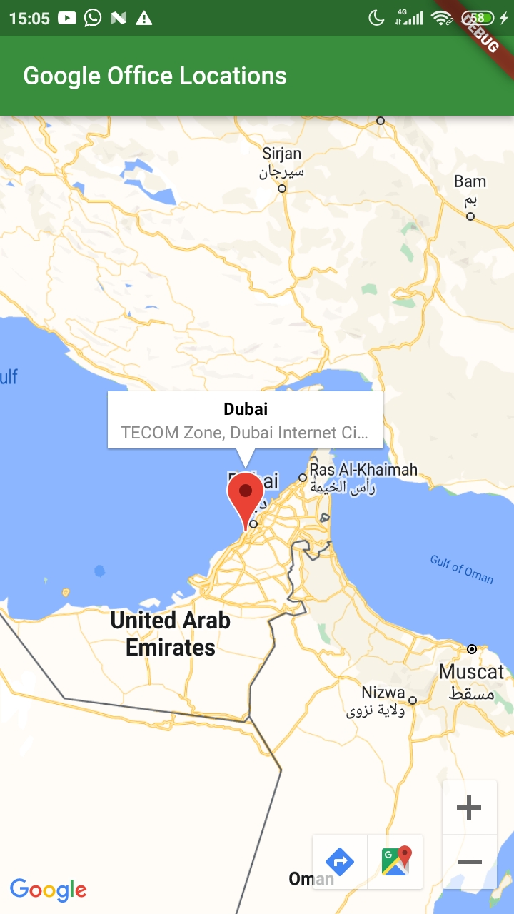

# google_maps_in_flutter

- Menampilkan peta di layar : menambahkan plugin google_maps_flutter_web

- Menempatkan google di peta: menambahkan 3 plugin baru yaitu http, serializable_json dan build_runner

- Menempatkan marker ke lokasi rumah 
